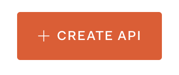
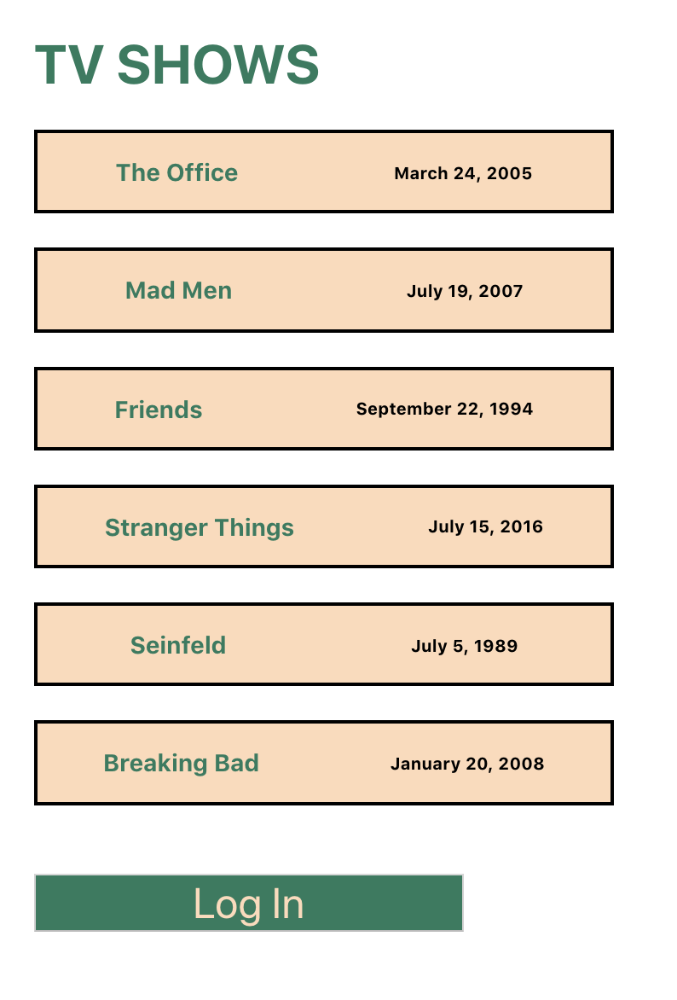
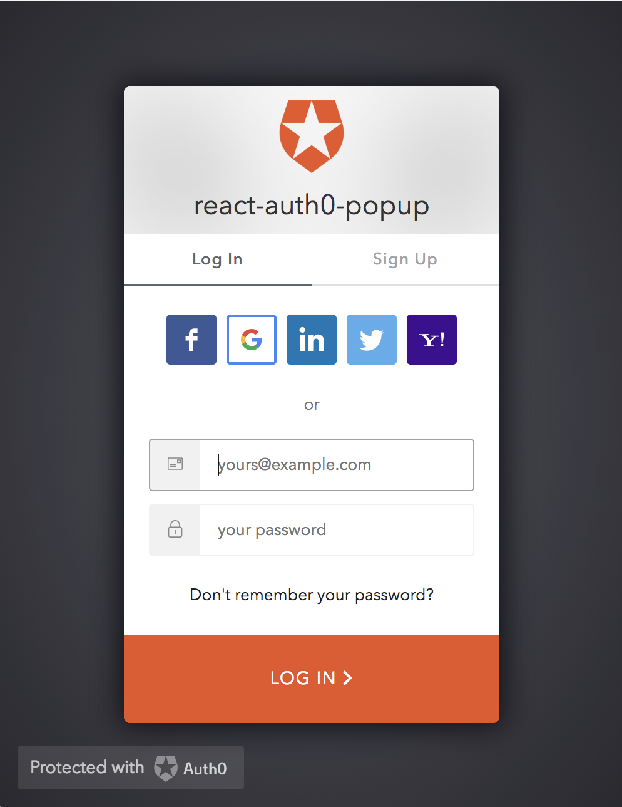
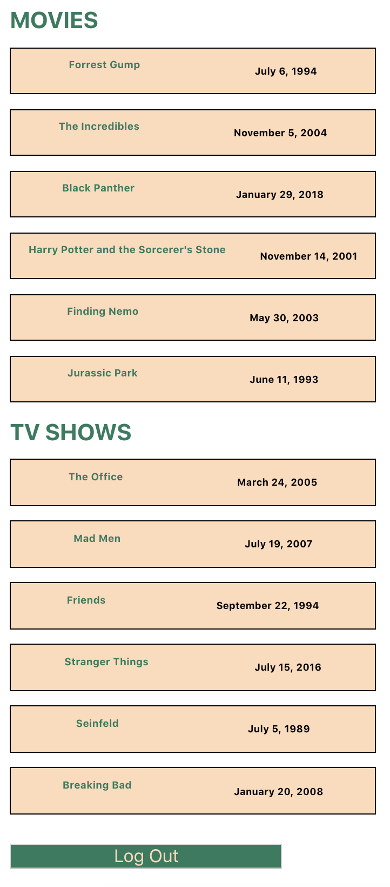
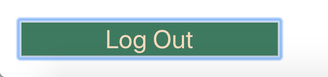

# Создайте приложение React с использованием всплывающей аутентификации и React Hooks #

в этом посте мы собираемся создать приложение React с аутентификацией Auth0, используя функцию всплывающих окон. Мы рассмотрим некоторые из новейших функций React, запустив наше приложение с create-react-app. Мы будем использовать React Hooks для написания компонентов без использования каких-либо классов. Мы также будем использовать поток аутентификации Auth0 для всплывающих окон и расскажем, как режим всплывающих окон может быть хорошим вариантом для вашего проекта. Вы можете найти репозиторий GitHub здесь.

## Новая функция React ##
React Hooks являются новыми с текущей версией, React 16.8. Это позволяет компонентам функций иметь состояние. Вам больше не нужен компонент класса, чтобы иметь состояние. Давайте узнаем больше о крючках.

### React Hooks ###
Хуки - это одно из последних дополнений в React, дающее вам возможность избежать написания компонента класса для использования состояния. Компоненты функций теперь более мощные и требуют меньше кода. Ура! Используйте ловушки, чтобы «зацепить» состояние в компонент функции, чтобы сделать его намного более универсальным.

<blockquote class="twitter-tweet"><p lang="en" dir="ltr">Hooks let you attach stuff (like state) to function components.</p>&mdash; Dan Abramov (@dan_abramov) <a href="https://twitter.com/dan_abramov/status/1056336137458016257?ref_src=twsrc%5Etfw">October 28, 2018</a></blockquote> <script async src="https://platform.twitter.com/widgets.js" charset="utf-8"></script>

Мы будем писать наши компоненты веб-интерфейса, используя Hooks. Когда мы рассмотрим код в приложении, мы обсудим, как реализовать эту новую функцию React.


## Всплывающая аутентификация Auth0 ##

Auth0 предлагает пользователям различные способы входа в систему. В сегодняшнем примере мы собираемся использовать метод popup. Пользователь сможет нажать кнопку, чтобы активировать всплывающее окно, пользователь войдет в систему, а затем всплывающее окно исчезнет после проверки подлинности.

У многих пользователей в браузере отключены всплывающие окна, поэтому, когда нет необходимости их использовать, мы рекомендуем не прибегать к методу всплывающих окон. Но всегда полезно знать, как это работает!

## Что мы будем строить сегодня ##

Сегодня мы собираемся создать одностраничное приложение с внутренним API. Первоначальный вид будет список ТВ-шоу с кнопкой `Log In` входа в систему. Пользователь сможет нажать кнопку `Log In` «Вход», и появится всплывающее окно входа в систему Auth0.

После успешного входа всплывающее окно исчезнет, и вид изменится на список фильмов и телепередач. Просмотр фильмов и телепередач будет защищен, поэтому он не будет отображаться, пока пользователь не будет аутентифицирован должным образом. Внизу этих списков будет кнопка `Log Out` «Выйти», которая приведет их к незащищенному просмотру только телевизионных шоу.

## Начало работы с React ##

Сегодня мы будем использовать команду `create-react-app` для поддержки нашего проекта React. Перейдите к месту, где вы хотели бы иметь свой новый проект, и введите команду:

```javascript
npx create-react-app react-auth0-popup
```

Эта команда не только запустит создание `create-react-app`, но и с помощью `npx`, она также устраняет необходимость локальной установки пакета и принесет последнюю версию. Чтобы использовать `npx`, у вас должен быть установлен NPM 5.2 или выше. Это великолепно; одна команда для обработки обеих задач. Как только это будет сделано, перейдите в проект:

```javascript
cd react-auth0-popup
```

Откройте проект в любой IDE, которую вы используете, и посмотрим, правильно ли работает наш проект. Запустите команду:

```javascript
npm run start
```

Затем он должен автоматически перейти на localhost: 3000 в браузере. Мы должны увидеть логотип React!

## Настройка Auth0 ##

Сегодня мы будем использовать Auth0 для аутентификации в нашем приложении. Чтобы создать новую учетную запись, [посетите страницу регистрации Auth0](https://auth0.com/signup "auth0.com - Sign Up"). Чтобы войти в существующую учетную запись, посетите [домашнюю страницу Auth0](https://auth0.com/ "Home Auth0"). После того, как мы войдем в систему, нажмите на большую кнопку в правом верхнем углу с надписью `+ New Application`.

Затем будет запущен модальный режим, и мы дадим нашему новому приложению имя «response-auth0-popup». Нажмите `Single Page Web App` - «Одностраничное веб-приложение», а затем нажмите `Create` - «Создать». Затем мы захотим нажать на опцию `React` для «технологии», которую мы будем использовать для нашего приложения. Мы рассмотрим, как интегрировать Auth0 в наш проект.

>Существует метод быстрого запуска, но мы рассмотрим реализацию Auth0 без использования быстрого запуска.

### Наш Auth0 API ###

Затем мы собираемся настроить наш API для нашего проекта. Это будет ("audience" aspect) аспект аудитории нашего приложения.

>Узнайте больше о параметре аудитории [здесь](https://auth0.com/docs/api-auth/tutorials/client-credentials "How to implement the Client Credentials Grant - Auth0").

Мы собираемся перейти к [панели инструментов Auth0 API](https://manage.auth0.com/dashboard/us/reactfrom/apis "APIs DASHBOARD"). Оттуда, нажмите на кнопку «Создать»:



>Примером имени `name` может быть «tvshows-movie-api», а примером идентификатора `identifier` может быть «https: // tvmoviesapi». Помните, что идентификатор нельзя изменить после его создания.
>

Оттуда мы нажмем на вкладку "Settings" - «Настройки» и увидим поля идентификатора и имени, заполненные той информацией, которую мы ввели. Мы будем использовать этот идентификатор чуть позже, так что пока держите его под рукой.

## Данные API для нашего SPA ##

Вернитесь к коду и приступим к настройке нашего API. Создайте папку `api` в корне проекта. В этой папке создайте папку `data`. Здесь у нас будет два отдельных файла. Один будет иметь данные для нашего списка "TV Shows" - «ТВ-шоу», а другой для нашего списка "Movies" - «Фильмы». Создайте файл в папке данных с названием `tvShows.json`. Мы собираемся сделать массив объектов. Вы можете использовать любые шоу или данные, которые вы хотите, у меня будет список из шести объектов о шести различных телевизионных шоу. Это будет выглядеть так:

```javascript
// api/data/tvShows.json
// be sure to delete the commented out file path name for our json files if copying and pasting.

[
  {
    "id": 1,
    "name": "The Office",
    "airDate": "March 24, 2005",
    "lastShowDate": "May 16, 2013",
    "aCastMember": "Steve Carell",
    "totalSeasons": "9",
    "totalEpisodes": "201",
    "interestingFact": "John Krazinski shot the footage of Scranton that appears in the show’s opening credits from his jeep when he and a few friends cased the city before he began shooting."
  },
  {
    "id": 2,
    "name": "Mad Men",
    "airDate": "July 19, 2007",
    "lastShowDate": "May 17, 2015",
    "aCastMember": "Jon Hamm",
    "totalSeasons": "7",
    "totalEpisodes": "92",
    "interestingFact": "The first and second episodes were shot one year apart."
  },
  {
    "id": 3,
    "name": "Friends",
    "airDate": "September 22, 1994",
    "lastShowDate": "May 6, 2004",
    "aCastMember": "Jennifer Aniston",
    "totalSeasons": "10",
    "totalEpisodes": "236",
    "interestingFact": "The theme song performed by The Rembrandts became a #1 single on the American pop charts."
  },
  {
    "id": 4,
    "name": "Stranger Things",
    "airDate": "July 15, 2016",
    "lastShowDate": "October 27, 2017",
    "aCastMember": "Millie Bobby Brown",
    "totalSeasons": "2",
    "totalEpisodes": "17",
    "interestingFact": "They auditioned 906 boys and 307 girls for the main roles."
  },
  {
    "id": 5,
    "name": "Seinfeld",
    "airDate": "July 5, 1989",
    "lastShowDate": "May 14, 1998",
    "aCastMember": "Julia Louis-Dreyfus",
    "totalSeasons": "9",
    "totalEpisodes": "180",
    "interestingFact": "Jerry says 'Hello, Newman' only 15 times in the entire series."
  },
  {
    "id": 6,
    "name": "Breaking Bad",
    "airDate": "January 20, 2008",
    "lastShowDate": "September 29, 2013",
    "aCastMember": "Aaron Paul",
    "totalSeasons": "5",
    "totalEpisodes": "62",
    "interestingFact": "Only two actors appear in every single episode, Aaron Paul and Bryan Cranston."
  }
]
```

В этой же папке с данными мы создадим файл с именем `movies.json`, в котором будет массив объектов, содержащих данные фильма. Мы сделаем список из шести объектов снова. Данные будут содержать такую информацию:

```javascript
// api/data/movies.json

[
  {
    "id": 1,
    "name": "Forrest Gump",
    "airDate": "July 6, 1994",
    "aCastMember": "Tom Hanks",
    "interestingFact": "During the ping-pong matches, there was no ball; it was entirely CGI, animated to meet the actors’ paddles."
  },
  {
    "id": 2,
    "name": "The Incredibles",
    "airDate": "November 5, 2004",
    "aCastMember": "Samuel L. Jackson",
    "interestingFact": "The original title of the film was 'The Invincibles.'"
  },
  {
    "id": 3,
    "name": "Black Panther",
    "airDate": "January 29, 2018",
    "aCastMember": "Chadwick Boseman",
    "interestingFact": "Chadwick Boseman (Black Panther) has a background in martial arts and did his own stunts."
  },
  {
    "id": 4,
    "name": "Harry Potter and the Sorcerer's Stone",
    "airDate": "November 14, 2001",
    "aCastMember": "Daniel Radcliffe",
    "interestingFact": "The book and movie are called 'Harry Potter and the Philosopher's Stone' everywhere except the United States."
  },
  {
    "id": 5,
    "name": "Finding Nemo",
    "airDate": "May 30, 2003",
    "aCastMember": "Ellen DeGeneres",
    "interestingFact": "The tiki heads in the tank are caricatures of Pixar employees."
  },
  {
    "id": 6,
    "name": "Jurassic Park",
    "airDate": "June 11, 1993",
    "aCastMember": "Jeff Goldblum",
    "interestingFact": "Jurassic Park was shot on location in 1992 on Hawaii's Kauai Island."
  }
]

```

## Файл конфигурации для API ##

В папке `api` мы хотим создать файл конфигурации, который будет содержать некоторые данные, которые нам нужны для наших маршрутов API, которые мы создадим через минуту. Теперь создайте новый файл `config.js` в папке `api`. Это будет иметь два элемента из API Auth0, который мы настроили ранее. Файл должен выглядеть примерно так:

```javascript
// api/config.js

module.exports = {
  AUTH0_DOMAIN: "yourauth0domain.auth0.com",
  AUDIENCE: "https://yourapifromauth0"
};

```


>Примечание. Эти учетные данные поступают из вашего приложения на панели мониторинга - dashboard Auth0, а не из  settings - настроек приложения API.
>

Как только мы это настроим, обязательно перейдите к нашему файлу .gitignore и укажите путь к этому файлу. Мы хотим, чтобы этот файл игнорировался, поэтому, когда он отправляется на GitHub, другие не могут получить нашу информацию Auth0.

## API-маршруты ##

Каждому из наших файлов, заполненных данными телешоу и фильма, необходимо назначить маршрут. В папке `api` мы захотим создать еще один файл, назовем его `routes.js`.

Нам нужно добавить пару зависимостей, которые будут использоваться в этом файле.

* express
* express-jwt
* jwks-rsa

Выполните следующую команду, чтобы установить эти зависимости проекта с помощью NPM:

```javascript
npm install --save express express-jwt jwks-rsa
```
После того, как они установлены, перенесите их в верхнюю часть файла `routes.js` вместе с путем:

```javascript
// api/routes.js

const express = require("express");
const jwt = require("express-jwt");
const jwks = require("jwks-rsa");
const path = require("path");
```
Кроме того, в верхней части файла импортируйте данные телешоу и фильма, настройки конфигурации аутентификации и настройте наш экспресс-маршрутизатор:

```javascript
// api/routes.js

// Other imports

const allShows = require("./data/tvShows");
const allMovies = require("./data/movies");
const config = require("./config");

const router = express.Router(); 
```

Отсюда давайте создадим функцию, которая будет проверять нашу аутентификацию:

```javascript
// api/routes.js

// imports here

const authCheck = jwt({
  secret: jwks.expressJwtSecret({
    cache: true,
    rateLimit: true,
    jwksRequestsPerMinute: 5,
    jwksUri: `https://${config.AUTH0_DOMAIN}/.well-known/jwks.json`
  }),
  audience: [config.AUDIENCE],
  issuer: `https://${config.AUTH0_DOMAIN}/`,
  algorithm: "RS256"
});

```

### Routes ###

Добавляя наши пути маршрутов, мы сможем проверить наши данные API. Используя такой продукт, как Postman, мы сможем проверить, отправляет ли http: // locahost: 3000 / api / сообщение «API работает» или http: // localhost: 3000 / api / data / tvshows возвращает список ТВ-шоу из наших данных API.

>Примечание. `/ Api / data / movies` будет отображаться только в том случае, если промежуточное программное обеспечение `authCheck` запущено без проблем.
>

```javascript
// api/routes.js

// Imports here

router.get("/", (req, res) => {
  res.sendFile(path.join(__dirname, "../build/index.html"));
  // When the application is built, this file will be created.
  // It currently is not created.
});

router.get("/api/", (req, res) => {
  res.send("API is working");
});

router.get("/api/data/tvshows", (req, res) => {
  res.json(allShows);
});

router.get("/api/data/movies", authCheck, (req, res) => {
  res.json(allMovies);
});

```

Не забудьте экспортировать информацию о нашем роутере внизу файла:

```javascript
// api/routes.js

// other code here

module.exports = router;
```
## SPA’s Server ##

Теперь, когда у нас есть готовый API, нам нужно убедиться, что наш сервер запущен и работает. В корне проекта создайте новую папку с именем `server`. В этой папке создайте файл с именем `server.js`. Здесь нам понадобится пара зависимостей, поэтому погрузимся в этот файл и давайте приступим к работе над ним.

Нам понадобятся следующие зависимости, установленные в вашем проекте для нашего файла сервера:

* body-parser
* cors

Запустив команду:

```javascript
npm install --save body-parser cors
```
Мы увидим, что добавлено в наш проект. Как только они будут завершены, давайте добавим их в файл нашего сервера, чтобы мы могли их использовать.

Вверху файла `server.js` мы хотим добавить следующие зависимости и путь к нашему файлу маршрутов. Также объявите наш порт:

```javascript
// server/server.js

const express = require("express");
const bodyParser = require("body-parser");
const cors = require("cors");
const routes = require("../api/routes");

const PORT = 3005;
```

Чтобы настроить приложение:

```javascript
// server/server.js

// Other imports

const app = express();
app.use(bodyParser.json());
app.use(bodyParser.urlencoded({ extended: true }));
app.use(cors());

```
Используя app.use, мы можем заставить наш сервер использовать наши ранее определенные маршруты:

```javascript
// server/server.js

app.use("/", routes);

```
Теперь, когда мы настроили наш сервер, давайте запустим его на порту. В нижней части нашего серверного приложения добавьте следующие строки:

```javascript
// server/server.js

// This is the last line of the file
app.listen(PORT, () => console.log(`Listening on port ${PORT}`));
```

После сохранения этого файла в нашем терминале в проекте запустите команду:

```javascript
node server/server.js
```
или 

```javascript
nodemon
```
Мы увидим, что это «Listening on port 3005». Теперь наш сервер работает!

## Создание нашего приложения ##
Теперь, когда мы настроили наш сервер и подготовили данные API, давайте создадим внешний интерфейс, чтобы мы могли просматривать эту информацию в веб-браузере.

### Учетные данные Auth0 ###

В нашем приложении мы будем использовать наши учетные данные Auth0. Для удобства мы будем хранить эти учетные данные в файле, чтобы их можно было легко импортировать в компоненты, которые в них нуждаются. Однако в целях безопасности мы включим этот файл в наш файл `.gitignore`, чтобы он не передавался в GitHub.

В папке `src` создайте папку `auth` и в ней создайте файл с именем `config.js`. Здесь мы хотим, чтобы это выглядело примерно так:

```javascript
// src/auth/config.js

export const config = {
  clientId: "your auth0 clientId",
  domain: "yourauth0domain.auth0.com",
  redirect: "http://localhost:3000/close-popup",
    // we will go over this redirect soon.
  logoutUrl: "http://localhost:3000",
  audience: "https://yourauth0api"
};
```
Используя наши учетные данные Auth0, заполните эту информацию, а затем укажите этот путь к файлу в файле `.gitignore`.

>Откройте файл .gitignore и вставьте эту строку в config.js. Это сделает свое дело! Чтобы узнать больше об игнорировании файлов, посетите [этот веб-сайт](https://help.github.com/en/articles/ignoring-files "Ignoring files gitHub Help").
>

Давайте перейдем на наши вкладки настроек под приложением, которое мы сделали ранее, мы увидим поля для наших "Allowed Callbacks URL" - «URL разрешенных обратных вызовов» и  "Allowed Logout URL"- «URL разрешенного выхода». Там мы добавим URL-адреса, которые мы поместили в наш файл `auth / config.js`.

>Это не из настроек API, а из настроек приложения.

Мы должны ввести следующее в раздел настроек приложения:

"Allowed Callback URLs" -> http://localhost:3000/close-popup "Allowed Logout URLs" -> http://localhost:3000

Обязательно сохраните свои изменения!

## Закрытие всплывающего окна ##

Всплывающее окно может быть хитрым, многие люди блокируют показ всплывающих окон в своем браузере. На Auth0 мы не рекомендуем использовать метод popup из-за их блокировки, но всегда полезно знать, как это сделать.

При использовании всплывающего окна нам потребуется отдельный файл, который обрабатывает закрытие всплывающего окна. В нашей `public` папке создайте другую папку, и мы назовем ее `close-popup`. Там создайте файл с именем `index.html`.

Здесь мы собираемся «перенаправить» после проверки подлинности. Мы хотим, чтобы файл `close-popup` запускался, и это всплывающее окно исчезало и возвращало пользователя к тому, что он делал.

Код в этом файле будет выглядеть так:

```html
// public/close-popup/index.html

<!DOCTYPE html>
<html lang="en">
  <head>
    <meta
      charset="utf-8"
      content="font-src: 'self' data: img-src 'self' data: default-src 'self'"
    />
    <title></title>
    <script src="https://cdn.auth0.com/js/auth0/9.8.1/auth0.min.js"></script>
  </head>
  <body>
    <script type="text/javascript">
      const webAuth = new auth0.WebAuth({
        domain: "your auth0 domain",
        clientID: "your client id"
      });
      webAuth.popup.callback();
    </script>
  </body>
</html>
```
Мы захотим поместить наши учетные данные приложения Auth0 в две строки, указывающие `domain` и `clientID`. Помните, что наш `domain` должен быть чем-то вроде `yourname.auth0.com`, а `clientID` будет длинной строкой символов.

После помещения этого файла в файл `.gitignore` у нас будет всплывающее окно, которое закроется после завершения процесса входа в систему. Мы помещаем его в `.gitignore`, потому что вы увидите, что в этом файле указаны наши учетные данные Auth0 (domain, clientID).

## Сервисный файл Auth0 ##

В этом файле происходит волшебство нашей аутентификации. В папке auth создайте файл service.js. Нам понадобится зависимость auth0-js. В командной строке введите:

```javascript
npm install --save auth0-js
```
Как только это будет установлено, мы собираемся импортировать наш файл `config.js` и нашу новую зависимость в начало нашего файла `auth / service.js` следующим образом:

```javascript
// src/auth/service.js

import { config } from "./config";
import * as Auth0 from "auth0-js";
```

Мы начнем с нашего компонента Auth и введем все наши элементы конфигурации. Под импортом вставьте следующий код:

```javascript
// src/auth/service.js

// Imports here

class Auth {
  auth0 = new Auth0.WebAuth({
    domain: config.domain,
    clientID: config.clientId,
    redirectUri: config.redirect,
    audience: config.audience,
    responseType: "id_token token",
    scope: "openid profile email"
  });

}
```

Обратите внимание, что в `responseType` у нас есть `id_token token`. Мы будем использовать как [токен id](https://auth0.com/docs/tokens/id-token "ID Token Auth0-Docs"), так и токен доступа - [access token](https://auth0.com/docs/tokens/overview-access-tokens " access token Auth-Docs") для этого проекта. И в [scope](https://auth0.com/docs/scopes/current "Scopes Auth0-Docs") у нас будет `openid`, `profile` и `email`.

### Настройка нашего `service.js` ###

Мы будем использовать разные переменные в наших функциях в файле `service.js`. Давайте возьмем те, которые установлены и объявлены. Установив для таких вещей, как `idToken` или `idTokenPayload` значение null, мы позволим себе при необходимости давать эти значения.

```javascript
// src/auth/service.js

// Imports...

class Auth {
  // auth0 definition...

  loginCallback = () => {};
  logoutCallback = () => {};

  userProfile = null;
  authFlag = "isLoggedIn";
  authStatus = this.isAuthenticated // we will create isAuthenticated soon
    ? "init_with_auth_flag"
    : "init_no_auth_flag";
  idToken = null;
  idTokenPayload = null;
  accessToken;

}
```

### localLogin и localLogout ###

Когда пользователь входит в систему, он активирует несколько разных функций. Функция входа в систему - `login` (которую мы вскоре рассмотрим) будет очень важной, но эта функция будет вызывать `localLogin`. В этой функции мы собираемся сохранить набор значений в переменные, которые мы установили чуть выше этого. `userProfile` теперь будет иметь аутентифицированные результаты `idTokenPayload`, которая имеет следующую информацию:

* Email
* Имя и фамилия
* Картинка (если есть)

Мы также хотим сохранить этот `accessToken`, чтобы позже мы могли сохранить его в заголовке.

На Auth0 мы не рекомендуем сохранять пользовательскую информацию в `localStorage`, но мы сохраним `authFlag` в `localStorage`. Установив для этого значение true, мы можем сохранить этот конкретный статус сеансов.

Мы также собираемся построить нашу функцию `localLogout` здесь. Это будет принимать информацию, которую мы хотим очистить, и очищать ее для нас, возвращая значение, равное `null`

```javascript
// src/auth/service.js

class Auth {
  // auth0 definition...  
  // other methods...

  localLogin(authResult) {
    localStorage.setItem(this.authFlag, true);
    this.idToken = authResult.idToken;
    this.userProfile = authResult.idTokenPayload;
    this.accessToken = authResult.accessToken;
    this.loginCallback({ loggedIn: true });
  }

  localLogout() {
    localStorage.removeItem(this.authFlag);
    this.userProfile = null;
    this.logoutCallback({ loggedIn: false });
  }

}
```

### Доступ к accessToken ###

Далее мы собираемся создать функцию, которая будет хранить значение нашего `accessToken`, чтобы мы могли использовать его позже.

```javascript
// src/auth/service.js
class Auth {
  // auth0 definition...
  // other methods...

  getAccessToken() {
    return this.accessToken;
  }

}
```
### Вход в систему ###

Когда наш пользователь нажимает кнопку «Войти» - `Log In` или какой-либо другой метод, который мы выбираем, мы хотим, чтобы наша функция входа в систему отключилась и обеспечила им бесперебойную работу. Наша функция входа - `login` function в систему будет использовать переменную `auth0`, которую мы установили ранее в файле, и использовать возможность всплывающих окон.

Запустив эту строку в функции входа в систему - `login function`:

```javascript
this.auth0.popup.authorize()
```

Мы собираемся активировать крутую функцию `popup` - всплывающих окон.

Мы собираемся проверить две вещи: аутентифицирован или нет.

Если их пользовательская информация будет передана, то эта функция предоставит нам `accessToken`, который мы будем использовать. Если нет, произойдет ошибка, и `localLogout ()` позаботится об этом.

Мы также добавим `isAuthenticated ()`, чтобы установить для localStorage `authFlag` значение `true`.

```javascript
// src/auth/service.js

class Auth {
  // auth0 definition...  
  // other methods...

  login() {
    this.auth0.popup.authorize({}, (err, authResult) => {
      console.log(err, authResult);
      if (err) this.localLogout();
      else {
        this.localLogin(authResult);
        this.accessToken = authResult.accessToken;
      }
    });
  }

  isAuthenticated() {
    return localStorage.getItem(this.authFlag) === "true";
  }

}
```

### Logging Out - выход из системы ###

Когда наш пользователь нажимает кнопку «Выйти» - `Log Out`, давайте удалим информацию, которую мы только что сохранили и использовали для аутентификации. Мы также будем вызывать `localLogout` и запускать его.

Мы также возьмем их в `logoutUrl`, который мы установили в нашем конфигурационном `config` - файле.

```javascript
// src/auth/service.js

class Auth {
  // auth0 definition...  
  // other methods...

  logout() {
    this.localLogout();
    this.auth0.logout({
      returnTo: config.logoutUrl,
      clientID: config.clientId
    });
  }

}

```

### Экспорт нашего `service.js` ###

Мы хотим свободно использовать эту информацию в нашем приложении, поэтому мы установим для `auth`  `new Auth ()`. Таким образом мы сможем использовать эти функции в родительских и дочерних компонентах.

Мы создаем экземпляр `Auth ()`, который будет размещен в этом модуле и может использоваться во всем приложении всем, что его импортирует.

Как только это объявлено, мы можем экспортировать - `export` этот файл. Мы в порядке!

```javascript
// src/auth/service.js

// These are the last two lines of the file

const auth = new Auth();

export default auth;
```
## Наши Frontend Components ##

Мы собираемся использовать три компонента для нашего приложения. Один родительский и два дочерних компонента.

1. App.js
2. TvShows.js
3. Movies.js

Компонент `App.js` уже существует и создан для нас. Когда мы запустили приложение `create-react-app`, оно создало для нас первоначальное представление. Мы можем зайти в этот файл и очистить его, мы будем его менять.

### App.js ###

Вверху нашего файла давайте импортируем вещи, которые нам понадобятся:

```javascript
// src/App.js

import React, { Component } from "react";
import TvShows from "./components/TvShows.js";
import Movies from "./components/Movies.js";
import auth from "./auth/service";
```
Мы еще не создали два таких импорта (это будут наши дочерние компоненты), и у нас также есть наш файл `auth / service.js`.

Наш `App` компонент позаботится о кнопках «Вход» - `Log In` и «Выход» - `Log Out` и о том, какой компонент мы хотим просмотреть.

Мы хотим установить наше состояние:

```javascript
this.state = { loggedIn: false };

// Full code below
```
Затем свяжите (`bind`) некоторые из наших функций:

```javascript
auth.loginCallback = this.loggedIn.bind(this);
auth.logoutCallback = this.loggedOut.bind(this);

// Full code below
```
Эти две функции будут переключать состояние для нас. Когда вызывается `loggedIn ()`, мы хотим, чтобы состояние `loggedIn` было изменено на `true`. С противоположным случаем для  `loggedOut ()`. Мы скоро увидим этот код.

Используя функцию ES6 Ternary, мы будем переключать наши кнопки «Вход»-`Log In` и «Выход»-`Log Out`, а также какой компонент показывать на странице.

To learn more about ES6 Ternary’s, visit [this page](https://developer.mozilla.org/en-US/docs/Web/JavaScript/Reference/Operators/Conditional_Operator "MDN Web-docs Conditional (ternary) operator").

Когда у нас есть эта логика, наш компонент должен выглядеть следующим образом:

```javascript
// src/App.js

class App extends Component {
  constructor(props) {
    super(props);

    auth.loginCallback = this.loggedIn.bind(this);
    auth.logoutCallback = this.loggedOut.bind(this);

    this.state = { loggedIn: false };
  }

  loggedIn() {
    this.setState({ loggedIn: true });
  }

  loggedOut() {
    this.setState({ loggedIn: false });
  }

  render() {
    return (
      <div>
        {this.state.loggedIn ? <Movies /> : <TvShows />}
        {this.state.loggedIn ? (
          <button onClick={() => auth.logout()} className="log-in">
            Log Out
          </button>
        ) : (
          <button onClick={() => auth.login()} className="log-in">
            Log In
          </button>
        )}
      </div>
    );
  }
}

export default App;
```

### TV Shows и Movies Components ###

У нас будет два дочерних компонента, `TvShows.js` и `Movies.js`. В обоих случаях мы будем использовать React Hooks. Сам компонент будет выглядеть знакомо, но некоторые функции будут выполнены по-другому.

Мы собираемся сделать наш компонент `TvShows.js` первым. В папке `src` мы собираемся создать еще одну папку с именем компоненты. В этой папке мы собираемся сделать три файла:

* TvShows.js
* Movies.js
* styles.css

#### Использование React Hooks ####

Мы используем [React Hooks](https://reactjs.org/docs/hooks-intro.html "Introducing Hooks React Docs") в этих файлах. Мы собираемся импортировать такие функции React, как, `useState` и `useEffect`.

* [Использование State Hook – React](https://reactjs.org/docs/hooks-state.html "Using the State Hook React Docs")
* [Использование Effect Hook – React](https://reactjs.org/docs/hooks-effect.html "Using the Effect Hook React Docs")

Представьте, что `useState` похож на `setState`, но теперь его можно использовать в функциональном компоненте; не нужно писать класс! И `useEffect` можно использовать вместо методов жизненного цикла, таких как `componentWillMount`.

### TV Shows Component ###

В верхней части файла `component / TvShows.js` мы собираемся импортировать вещи, которые нам понадобятся:

```javascript
// src/components/TvShows.js

import React, { useState, useEffect } from "react";
import "./styles.css";
```
И затем запустите компонент:

```javascript
// src/components/TvShows.js

// Imports here

function TvShows() {

}
```

Чтобы настроить состояние `state` в нашем компоненте, мы собираемся сделать это немного по-другому:

```javascript
// src/component/TvShows.js

// Imports here

function TvShows() {
    const [shows, setShows] = useState([]);
}

```
1. Переменная `shows` похожа на `this.state`.
2. Вторая `setShows` похожа на `this.setState`.
3. Эта третья часть, `useState ([])` будет нашим начальным значением состояния.

Познакомились!

Далее мы будем использовать `useEffect` вместо `componentDidMount`. Используя `fetch`, давайте вызовем данные нашего API и получим ответ.

```javascript
// src/component/TvShows.js

// Imports here

function TvShows() {
    const [shows, setShows] = useState([]);

  useEffect(() => {
    fetch("http://localhost:3005/api/data/tvShows")
      .then(response => response.json())
      .then(data => {
        setShows(data);
      });
  }, []);
}

```
Мы собираемся просмотреть `show.name` и `show.airDate`, но помните, у нас есть целый список, из которого мы можем выбрать:

1. id
2. name
3. airDate
4. lastShowDate
5. aCastMember
6. totalSeasons
7. totalEpisodes
8. interestingFact

```javascript
// src/components/TvShows.js

import React, { useState, useEffect } from "react";
import "./styles.css";

function TvShows() {
  const [shows, setShows] = useState([]);

  useEffect(() => {
    fetch("http://localhost:3005/api/data/tvShows")
      .then(response => response.json())
      .then(data => {
        setShows(data);
      });
  }, []);

  return (
    <div>
      <h1>TV SHOWS</h1>
      {shows.map(shows => (
        <div className="card" key={shows.id}>
          <h3>{shows.name}</h3>
          <h5>{shows.airDate}</h5>
        </div>
      ))}
    </div>
  );
}

export default TvShows;

```
Эта информация допустима независимо от того, аутентифицирован ли пользователь, эта информация не является «защищенной».

### Movies Component ###

Этот компонент будет очень похож на компонент `TvShows.js`. Основными отличиями являются:

* Хранение токена доступа - accessToken 
* Импорт файла `/ auth / service`.

Используя `getAccessToken ()` из файла `/auth/service.js`, мы собираемся сохранить `accessToken` в заголовке и вызвать маршрут фильмов API - API movies route.

На данный момент мы будем просматривать `movies.name` и `movies.airDate`, но у нас есть большой список на выбор.

После того как пользователь войдет в систему, он будет переведен в это представление, в котором также есть компонент `TvShows`. Это позволит пользователю одновременно видеть оба компонента после проверки подлинности.

```javascript
// src/component/Movies.js

import React, { useState, useEffect } from "react";
import "./styles.css";
import TvShows from "./TvShows";
import auth from "../auth/service";

function Movies() {
  const [movies, setMovies] = useState([]);

  useEffect(() => {
    fetch("http://localhost:3005/api/data/movies", {
      headers: {
        Authorization: `Bearer ${auth.getAccessToken()}`
      }
    })
      .then(response => response.json())
      .then(data => {
        setMovies(data);
      });
  }, []);

  return (
    <div>
      <h1>MOVIES</h1>
      {movies.map(movies => (
        <div key={movies.id} className="card">
          <h3>{movies.name}</h3>
          <h5>{movies.airDate}</h5>
        </div>
      ))}
      <TvShows />
    </div>
  );
}

export default Movies;
```
#### Стилизация ####

Давайте сделаем наш пользовательский интерфейс немного красивее!

```css
/* src/components/styles.css */

.App {
  display: flex;
  justify-content: center;
  align-items: center;
  flex-direction: column;
}

h3 {
  color: rgb(33, 124, 94);
}

.card {
  border: 2px solid black;
  width: 20%;
  background-color: peachpuff;
  display: flex;
  flex-wrap: wrap;
  justify-content: space-around;
  margin: 20px;
  font-size: 12px;
}

.log-in {
  width: 15%;
  color: peachpuff;
  background-color: rgb(33, 124, 94);
  font-size: 25px;
  margin: 20px;
}

h1 {
  color: rgb(33, 124, 94);
  margin: 20px;
}

```
### Наше законченное приложение ### 

Когда `localhost: 3000` запущен в браузере с помощью `npm start`, мы должны увидеть это:



Когда пользователь нажимает кнопку «Войти», оно открывает всплывающее окно, не отходя от текущего представления.



Пользователь войдет в систему со своими учетными данными, и всплывающее окно исчезнет, и отобразится наш компонент «Фильмы». Затем пользователь увидит список фильмов и телепередач.




Кнопка «Войти» `Log In` изменится на кнопку «Выйти» `Log Out`, и если мы «осмотрим» страницу, перейдем на вкладку «Сеть», нажмите «фильмы» и в разделе «Заголовки» мы можем прокрутить вниз и увидеть, что `accessToken` начать хранить.



```javascript
Authorization: Bearer "token"
```
Если пользователь нажмет «Выйти», это приведет его к неавторизованному просмотру только «ТВ-шоу», и сеанс будет прерван.

### О Auth0 ###

Auth0, мировой лидер в области «Идентификация как услуга» (Identity-as-a-Service IDaaS), предоставляет тысячам клиентов в каждом секторе рынка единственное решение для идентификации, которое им необходимо для их веб, мобильных, IoT и внутренних приложений. Его расширяемая платформа легко аутентифицирует и защищает более 2,5 миллиардов логинов в месяц, делая ее любимой разработчиками и пользующейся доверием со стороны глобальных предприятий. Штаб-квартира компании в США в Белвью, штат Вашингтон, и дополнительные офисы в Буэнос-Айресе, Лондоне, Токио и Сиднее поддерживают своих клиентов по всему миру, которые расположены в более чем 70 странах.

Для получения дополнительной информации посетите https://auth0.com или следуйте [@ auth0 в Twitter](https://twitter.com/auth0 "Twitter Auth0").

[Зарегистрируйте бесплатную учетную запись Auth0 здесь](https://auth0.com/signup "Sign Up Auth0")

### Заключение ###
Всплывающий метод входа в систему удобен, потому что он не перенаправляет пользователя с его текущего экрана. Недостатком является то, что многие пользователи блокируют всплывающие окна, поэтому это может быть не лучшим выбором для аутентификации.

В нашем проекте мы смогли реализовать метод popup и использовать новые React Hooks. В зависимости от вашего проекта, всплывающее окно может быть вашим способом.


[React Tutorial with Popup Authentication](https://auth0.com/blog/build-react-apps-using-react-hooks-and-auth0-auth-popup/ "Auth0-docs") Оригинал доступен по ссылке. <br/>
Автор перевода [Yaroslav Kolesnikov](https://github.com/YaroslavW "My gitHub")


